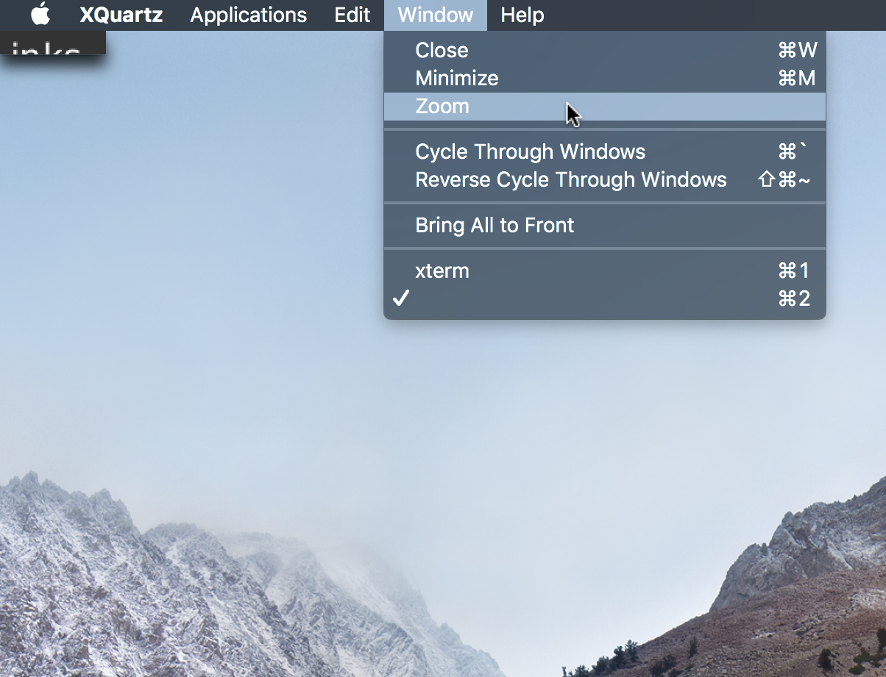
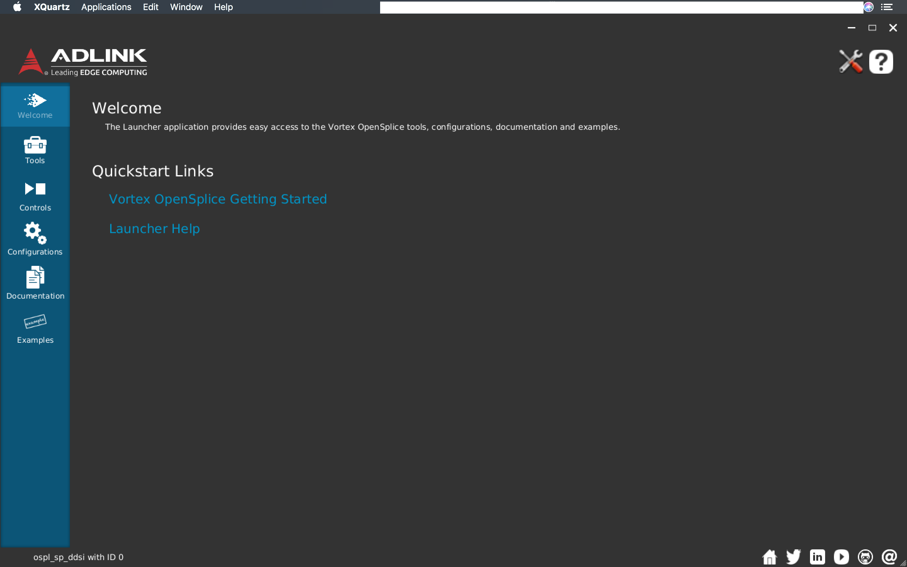
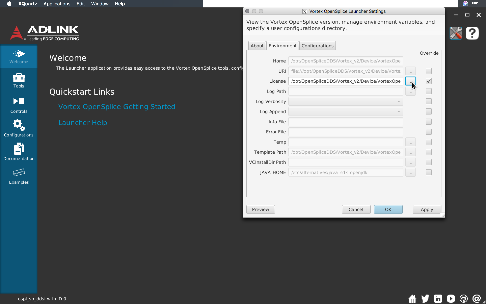

# Using ADLink tools on MacOS
To use ADLink tools we need to use the commercial version of open splice.
A special container is built with that purpose but to use those tools some extra steps needs to be taken.

These instructions are designed for use with Docker on MacOS.
It is very likely that different procedures are needed for other environments.

1. Pull image with open splice 6.10.2.
	```
	$ docker pull lsstts/develop-env:opensplice6.10
	```
2. Enable indirect GLX
	```
	$ defaults write org.macosforge.xquartz.X11 enable_iglx -bool true
	```
3. Restart Xquartz
4. Enable connection between Xquartz and docker (you need to do this every time you restart Xquartz)
	```
	$ xhost + 127.0.0.1
	```
5. The license we have available is made so it will only work for a specific IP address (10.0.100.1). 
	In order for it to work the container must have this IP address.
	For that we need to create a bridge network with the proper subnet and gateway.
	```
	$ docker network create --driver bridge --gateway 10.0.100.254 --subnet 10.0.100.0/16 test
	```
	This command creates the network called test with the parameters we need.
6. The next step is to run the container and add it to the test network.
	The container is stripped of the license so in order to make it available, make sure you have the license on your computer and export it with the run command.
	For that you run:
	```
	$ docker run -it --rm --net test --ip 10.0.100.1 -e DISPLAY=host.docker.internal:0 -v /tmp/.X11-unix:/tmp/.X11-unix -v <path_to_license>:/opt/OpenSpliceDDS/V6.10.2/HDE/x86_64.linux/etc/opensplice6.10-10.0.100.1LK12619.lic lsstts/develop-env:opensplice6.10
	#
	# Loading LSST Stack
	#
	# Loading sal environment
	SAL development environment is configured
	<<< Vortex OpenSplice HDE Release 6.10.2 For x86_64.linux, Date 2019-03-07 >>>
	LSST middleware toolset environment v3.10.0 is configured
	#
	# Setting up sal, salobj and scriptqueue
	[saluser@2a91e9324a5a ~]$
	```
	Note that in line 7 the container is setup with "Vortext OpenSplice HDE Release 6.10.2".
	The container is already setup with the latest open splice version and should be ready to go.
7. Once inside the container, you need to run `opsllauncher` and select the license.
	```
	[saluser@2a91e9324a5a ~]$ ospllauncher
	<SUPRESSED LOG INFO>
	Prism-ES2 Error : GL_VERSION (major.minor) = 1.4
	22:25:21.696 [Thread-18] ERROR o.o.t.l.model.utils.JavaHomeStatus - Unable to detect a supported installed version of Java JRE.
	22:25:21,729 |-WARN in ch.qos.logback.core.FileAppender[FILE] - Attempted to append to non started appender [FILE].
	```
	There are a couple of things to notice once `ospllauncher` starts.
	The last three lines seems to suggest an error at execution, even though the program is still running.
	It is very likely that the program was launched but you will not see any window.
	Note, however that the "focus" probably switched to `XQuartz`.
	If that happened and you don't see ADLink software window, go to the "Window" option on `XQuartz` menu bar and select "Zoom".
	
	Once you click Zoom, you should see the full software window.
	
	To select the license, go to settings (tool icon at the upper-right corner).
	This will open a new window.
	Select Environment:
	
	Then, select override and the [...] button to open the selection window:
	
	And open the file with the license.
	
	Apply the changes, click the `[OK]` button to close the window and you should be good to go.

!!! Note
	For some reason, launching the test programs from the ospllauncher don't work.
	Once you have selected the license it is better to close the software and launch the ospltest from the command line.
	Also, it is possible to skip the license selection process by mounting the license to the default location (`/opt/OpenSpliceDDS/V6.10.2/HDE/x86_64.linux/etc/opensplice6.10-10.0.100.1LK12619.lic`).